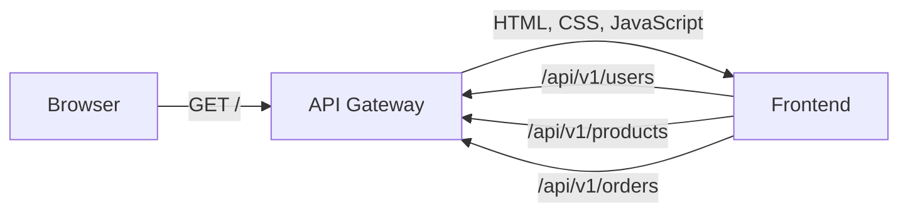

# NexusCart Frontend

The NexusCart frontend is a React and TypeScript storefront for browsing the
seeded catalog, selecting a customer, creating an order, and reviewing recent
orders. It uses the API Gateway as its only backend entry point.

## ✨ Highlights

- React 19, TypeScript, and Vite.
- Same-origin API calls through the relative `/api/v1` prefix.
- Parallel loading of users, products, and orders.
- Client-side order creation with stock-aware quantity controls.
- Request-aware error messages that expose the distributed `requestId`.
- Multi-stage container build with NGINX and SPA fallback routing.
- Versioned `GET /health` endpoint for deployment verification.

## 🧭 Application Context



The browser never needs direct service URLs. During local development, Vite
proxies `/api` to `http://localhost:8080`. In a deployed environment, the API
Gateway serves the frontend and routes the same relative API paths.

## 🛍️ User Capabilities

- Browse the product catalog and current stock.
- Select one of the seeded customers.
- Add products and quantities to a cart.
- Submit an order with totals recalculated by the Order Service.
- Review orders created during the current Order Service process lifetime.

## 🚀 Quick Start

### Prerequisites

- Node.js 24 and npm.
- API Gateway running on `http://localhost:8080` for live API data.

```bash
npm ci
npm run dev
```

Open <http://localhost:5173>. The Vite server listens on all interfaces and
forwards `/api/*` requests to the local gateway.

To run the complete application instead, start Docker Compose from the sibling
`config-management` repository.

## 🔌 API Usage

| Request | Frontend behavior |
|---|---|
| `GET /api/v1/users` | Loads customers for checkout |
| `GET /api/v1/products` | Loads catalog items, prices, and stock |
| `GET /api/v1/orders` | Loads recent orders |
| `POST /api/v1/orders` | Creates an order from the selected cart |

The API client expects the common error shape used across NexusCart:

```json
{
  "error": {
    "code": "INSUFFICIENT_STOCK",
    "message": "Product prd-001 only has 10 item(s) in stock",
    "requestId": "docs-request-001"
  }
}
```

When present, the `requestId` is included in the visible error message to make
cross-service troubleshooting easier.

## ✅ Quality Gates

| Command | Purpose |
|---|---|
| `npm run typecheck` | Checks TypeScript without emitting files |
| `npm run test:run` | Runs the Vitest suite once |
| `npm run build` | Type-checks and creates the production bundle |
| `npm test` | Runs Vitest in interactive mode |

Run the same non-interactive checks used by CI:

```bash
npm ci
npm run typecheck
npm run test:run
npm run build
```

## 🐳 Container Image

```bash
docker build -t nexuscart-frontend:local .
docker run --rm -p 8088:80 -e APP_VERSION=local nexuscart-frontend:local
```

The standalone container serves the static application at
<http://localhost:8088> and health data at <http://localhost:8088/health>:

```json
{
  "status": "UP",
  "service": "frontend",
  "version": "local"
}
```

The production image is designed to sit behind the API Gateway. Running it by
itself verifies the UI and health endpoint, but does not provide an `/api`
upstream.

## ⚙️ Runtime Configuration

| Variable | Default | Purpose |
|---|---|---|
| `APP_VERSION` | `1.0.0` | Version returned by the NGINX health endpoint |

The API base path is intentionally fixed to `/api/v1`; no backend hostname is
embedded in the browser bundle.

## 🔁 CI/CD

`azure-pipelines.yml` is a small entry point that composes reusable checkout,
Node setup, install, Vitest, report, and Qodana step templates from
`config-management`. Shared stage and job templates own the orchestration.

- Every branch publishes JUnit and coverage reports, runs Qodana, builds the
  container image, and scans it with Trivy.
- `main` pushes the `$(Build.BuildId)` and `latest` tags to Azure Container
  Registry.

## 📁 Repository Structure

```text
frontend/
├── src/
│   ├── api.ts              # Typed API client
│   ├── App.tsx             # Storefront and checkout flow
│   ├── App.test.tsx        # UI integration tests
│   ├── styles.css          # Application styling
│   └── types.ts            # Shared frontend models
├── azure-pipelines.yml     # Pipeline entry point
├── Dockerfile              # Vite build and NGINX runtime
├── nginx.conf              # SPA and health endpoint configuration
├── package.json
└── vite.config.ts          # Dev proxy and Vitest configuration
```
